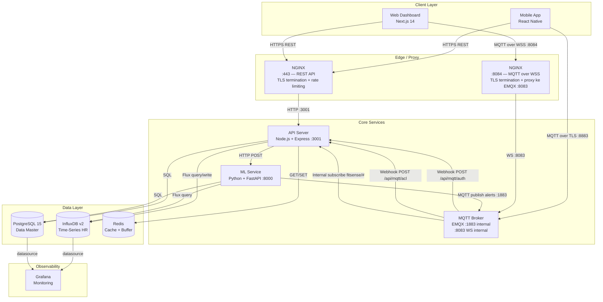
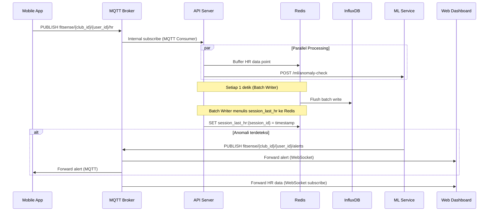
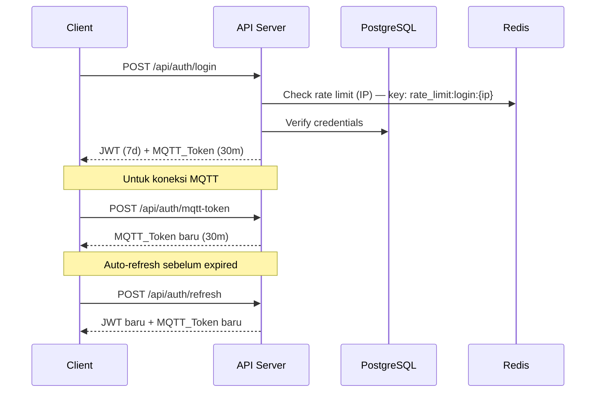

# Dokumen Desain — FitSense Platform

**Versi:** 1.1  
**Tanggal:** 2026-04-06  
**Status:** Revisi — perbaikan architecture diagram, tambahan interface, index database, Redis documentation, test environment setup, dan coverage target

---

## Overview

FitSense adalah platform SaaS multi-tenant untuk monitoring heart rate (HR) secara real-time di gym. Platform ini dirancang untuk mendukung banyak club gym sebagai tenant yang terisolasi satu sama lain, dengan empat komponen utama yang bekerja secara terpadu:

- **Mobile App** (React Native) — menghubungkan sensor HR via BLE dan mempublikasikan data ke broker MQTT
- **Web Dashboard** (Next.js 14) — tampilan real-time untuk trainer, club owner, dan super admin
- **API Server** (Node.js + Express) — orkestrasi bisnis, autentikasi, dan penyimpanan data
- **ML Service** (Python + FastAPI) — deteksi anomali HR dan rekomendasi latihan

### Tujuan Desain

1. **Isolasi multi-tenant** — setiap club memiliki data yang sepenuhnya terisolasi
2. **Real-time dengan latensi rendah** — data HR harus tampil di dashboard dalam < 1 detik
3. **Skalabilitas** — mendukung hingga 100 member aktif per club secara bersamaan
4. **Keandalan** — sistem harus toleran terhadap kegagalan koneksi sementara
5. **Keamanan** — autentikasi berlapis (JWT + MQTT_Token) dengan RBAC ketat

---

## Architecture

### Diagram Arsitektur Sistem



> **Catatan routing NGINX:**
> - Port `:443` menerima semua traffic HTTPS dan mem-proxy ke API Server di `:3001`
> - Port `:8084` menerima koneksi WebSocket terenkripsi (WSS) dari browser dan mem-proxy ke EMQX WebSocket listener di `:8083` (plain WS, internal network)
> - Mobile App terhubung langsung ke EMQX port `:8883` (MQTT over TLS) tanpa melalui NGINX karena menggunakan native MQTT client bukan WebSocket

### Alur Data Real-Time (HR Data Flow)



### Alur Autentikasi



---

## Components and Interfaces

### 1. API Server (Node.js + Express)

#### Sub-komponen

| Komponen                | Tanggung Jawab                                                   |
| ----------------------- | ---------------------------------------------------------------- |
| `AuthService`           | Login, JWT/MQTT_Token generation, refresh, logout, rate limiting |
| `ClubService`           | CRUD club, validasi slug                                         |
| `MemberService`         | CRUD member, validasi email unik                                 |
| `SessionService`        | Start/end sesi, orphan session cleanup                           |
| `HRQueryService`        | Query InfluxDB dengan filter tenant                              |
| `RecommendationService` | Proxy ke ML service, simpan hasil                                |
| `MqttWebhookHandler`    | Validasi auth/ACL untuk EMQX                                     |
| `MqttConsumer`          | Subscribe `fitsense/#`, distribusi paralel                       |
| `BatchWriter`           | Buffer Redis → flush InfluxDB tiap 1 detik                       |
| `HRZoneClassifier`      | Klasifikasi zona HR berdasarkan usia                             |
| `OrphanSessionJob`      | Cron job tiap 30 menit, tutup sesi terbengkalai                  |
| `InviteService`         | Generate/validasi kode undangan                                  |
| `PasswordResetService`  | Forgot/reset password dengan token sekali pakai                  |

#### Interface Utama

```typescript
// JWT Payload
interface JwtPayload {
  userId: string;
  clubId: string | null; // null untuk super_admin
  role: "super_admin" | "club_owner" | "trainer" | "member";
  exp: number;
}

// MQTT Token Payload
interface MqttTokenPayload {
  userId: string;
  clubId: string;
  role: string;
  allowedTopics: string[];
  exp: number;
}

// HR Data Point (setelah parsing MQTT)
interface HRDataPoint {
  hr: number;        // 20-300 bpm
  rr?: number;       // 200-2000 ms
  sessionId: string;
  timestamp: number; // Unix ms
  clubId: string;
  userId: string;
  hrZone: HRZone;
}

type HRZone = "rest" | "fat_burn" | "cardio" | "aerobic" | "peak" | "unknown";

// InviteService — tambahan
interface InviteCode {
  id: string;
  clubId: string;
  code: string;
  createdBy: string;   // userId pembuat
  usedBy: string | null;
  expiresAt: Date;     // NOW() + 7 hari
  usedAt: Date | null;
  createdAt: Date;
}

interface CreateInviteResult {
  code: string;
  registrationUrl: string; // https://{domain}/register?invite={code}
  expiresAt: Date;
}

// PasswordResetService — tambahan
interface PasswordResetToken {
  id: string;
  userId: string;
  tokenHash: string;  // SHA-256 dari raw token, disimpan di DB
  expiresAt: Date;    // NOW() + 1 jam
  usedAt: Date | null;
  createdAt: Date;
}

interface RequestResetResult {
  // Selalu success (HTTP 200) untuk mencegah enumerasi email
  // Email dikirim secara async jika email terdaftar
  sent: boolean;
}
```

### 2. ML Service (Python + FastAPI)

#### Sub-komponen

| Komponen               | Tanggung Jawab                                    |
| ---------------------- | ------------------------------------------------- |
| `AnomalyChecker`       | Evaluasi anomali real-time per data point         |
| `SessionAnalyzer`      | Analisis post-session, generate rekomendasi       |
| `AlertCooldownManager` | State cooldown per member per jenis alert (Redis) |
| `ZoneStateTracker`     | Lacak zona aktif dan durasi per member (Redis)    |

#### Interface Utama

```python
# Request anomaly check
class AnomalyCheckRequest(BaseModel):
    hr: int
    rr: Optional[float]
    session_id: str
    user_id: str
    club_id: str
    timestamp: int
    hr_zone: str
    max_hr: int
    duration_in_zone_seconds: int

# Response anomaly check
class AnomalyCheckResponse(BaseModel):
    has_alert: bool
    alert_type: Optional[str]   # "CRITICAL" | "WARNING"
    alert_message: Optional[str]
    skipped_cooldown: bool

# Request analyze session
class AnalyzeSessionRequest(BaseModel):
    session_id: str
    user_id: str
    club_id: str
```

### 3. MQTT Broker (EMQX)

EMQX dikonfigurasi dengan dua webhook:

| Webhook             | URL                   | Trigger                  |
| ------------------- | --------------------- | ------------------------ |
| Authentication      | `POST /api/mqtt/auth` | Setiap client connect    |
| Authorization (ACL) | `POST /api/mqtt/acl`  | Setiap publish/subscribe |

#### ACL Matrix

| Role          | Publish                               | Subscribe                                                                |
| ------------- | ------------------------------------- | ------------------------------------------------------------------------ |
| `member`      | `fitsense/{club_id}/{user_id}/hr`     | `fitsense/{club_id}/{user_id}/hr`, `fitsense/{club_id}/{user_id}/alerts` |
| `trainer`     | — (dilarang)                          | `fitsense/{club_id}/#`, `fitsense/{club_id}/+/alerts`                    |
| `club_owner`  | — (dilarang)                          | `fitsense/{club_id}/#`, `fitsense/{club_id}/+/alerts`                    |
| `super_admin` | — (dilarang)                          | `fitsense/#`                                                             |
| `ml_service`  | `fitsense/{club_id}/{user_id}/alerts` | —                                                                        |

### 4. Web Dashboard (Next.js 14)

#### Komponen Utama

| Komponen                   | Tanggung Jawab                                                      |
| -------------------------- | ------------------------------------------------------------------- |
| `useMqtt` hook             | Manajemen koneksi MQTT via WebSocket, auto-reconnect, token refresh |
| `HRMonitor`                | Tampilan HR real-time per member                                    |
| `HRZoneBadge`              | Badge zona HR dengan warna                                          |
| `AlertBanner`              | Notifikasi anomali yang menonjol                                    |
| `MemberList` (virtualized) | Daftar member dengan react-window, max 100 item di DOM              |
| `MemberSearch`             | Pencarian member berdasarkan nama                                   |

#### Strategi Koneksi MQTT

```typescript
// Exponential backoff reconnect
const reconnectDelay = Math.min(1000 * 2 ** attempt, 60000);
```

### 5. Mobile App (React Native)

#### Komponen Utama

| Komponen         | Tanggung Jawab                                  |
| ---------------- | ----------------------------------------------- |
| `BLEManager`     | Scan, connect, dan baca data dari sensor Coospo |
| `MqttPublisher`  | Publish HR data ke broker, auto-refresh token   |
| `SessionManager` | Start/end sesi, state management                |
| `HRDisplay`      | Tampilan HR real-time selama sesi               |

#### BLE Reconnect Strategy

```
Attempt 1: 1 detik
Attempt 2: 2 detik
Attempt 3: 4 detik
...
Max: 30 detik
```

---

## Data Models

### PostgreSQL

#### Table: `clubs`

```sql
CREATE TABLE clubs (
  id          UUID PRIMARY KEY DEFAULT gen_random_uuid(),
  name        VARCHAR(100) NOT NULL,
  slug        VARCHAR(50)  UNIQUE NOT NULL
                CHECK (slug ~ '^[a-z0-9-]{3,50}$'),
  address     TEXT,
  phone       VARCHAR(20),
  status      VARCHAR(20)  DEFAULT 'active'
                CHECK (status IN ('active', 'suspended')),
  created_at  TIMESTAMPTZ  DEFAULT NOW()
);
```

#### Table: `users`

```sql
CREATE TABLE users (
  id            UUID PRIMARY KEY DEFAULT gen_random_uuid(),
  club_id       UUID REFERENCES clubs(id) ON DELETE CASCADE,
  name          VARCHAR(100) NOT NULL,
  email         VARCHAR(150) UNIQUE NOT NULL,
  password_hash TEXT NOT NULL,
  role          VARCHAR(20)  NOT NULL
                  CHECK (role IN ('super_admin','club_owner','trainer','member')),
  age           INTEGER,
  gender        VARCHAR(10),
  status        VARCHAR(20)  DEFAULT 'active'
                  CHECK (status IN ('active', 'inactive')),
  created_at    TIMESTAMPTZ  DEFAULT NOW()
);

CREATE INDEX idx_users_club_id ON users(club_id);
CREATE INDEX idx_users_email   ON users(email);
```

#### Table: `sessions`

```sql
CREATE TABLE sessions (
  id               UUID PRIMARY KEY DEFAULT gen_random_uuid(),
  user_id          UUID REFERENCES users(id),
  club_id          UUID REFERENCES clubs(id),
  started_at       TIMESTAMPTZ NOT NULL,
  ended_at         TIMESTAMPTZ,
  avg_hr           INTEGER,
  max_hr           INTEGER,
  min_hr           INTEGER,
  duration_minutes INTEGER,
  hr_zone          VARCHAR(20),
  auto_closed      BOOLEAN DEFAULT FALSE,
  created_at       TIMESTAMPTZ DEFAULT NOW()
);

CREATE INDEX idx_sessions_user_id    ON sessions(user_id);
CREATE INDEX idx_sessions_club_id    ON sessions(club_id);
CREATE INDEX idx_sessions_started_at ON sessions(started_at DESC);
```

#### Table: `ml_recommendations`

```sql
CREATE TABLE ml_recommendations (
  id           UUID PRIMARY KEY DEFAULT gen_random_uuid(),
  user_id      UUID REFERENCES users(id),
  session_id   UUID REFERENCES sessions(id),
  type         VARCHAR(30) NOT NULL
                 CHECK (type IN ('workout_recommendation','anomaly_alert','zone_summary')),
  content      JSONB NOT NULL,
  generated_at TIMESTAMPTZ DEFAULT NOW()
);

CREATE INDEX idx_ml_rec_user_id      ON ml_recommendations(user_id);
CREATE INDEX idx_ml_rec_generated_at ON ml_recommendations(generated_at DESC);
```

#### Table: `devices`

```sql
CREATE TABLE devices (
  id            UUID PRIMARY KEY DEFAULT gen_random_uuid(),
  user_id       UUID REFERENCES users(id),
  club_id       UUID REFERENCES clubs(id),
  device_type   VARCHAR(50)
                  CHECK (device_type IN ('coospo_h6','coospo_hw706')),
  mac_address   VARCHAR(20),
  registered_at TIMESTAMPTZ DEFAULT NOW(),
  UNIQUE (user_id, mac_address)
);
```

#### Table: `invite_codes`

```sql
CREATE TABLE invite_codes (
  id         UUID PRIMARY KEY DEFAULT gen_random_uuid(),
  club_id    UUID REFERENCES clubs(id),
  code       VARCHAR(64) UNIQUE NOT NULL,
  created_by UUID REFERENCES users(id),
  used_by    UUID REFERENCES users(id),
  expires_at TIMESTAMPTZ NOT NULL,
  used_at    TIMESTAMPTZ,
  created_at TIMESTAMPTZ DEFAULT NOW()
);

-- tambahan: index untuk lookup kode undangan saat registrasi
CREATE INDEX idx_invite_codes_code       ON invite_codes(code);
CREATE INDEX idx_invite_codes_club_id    ON invite_codes(club_id);
CREATE INDEX idx_invite_codes_expires_at ON invite_codes(expires_at);
```

#### Table: `password_reset_tokens`

```sql
CREATE TABLE password_reset_tokens (
  id         UUID PRIMARY KEY DEFAULT gen_random_uuid(),
  user_id    UUID REFERENCES users(id),
  token_hash TEXT UNIQUE NOT NULL,
  -- token_hash adalah SHA-256 dari raw token yang dikirimkan ke email user.
  -- Raw token TIDAK disimpan di database. Server hanya menyimpan hash-nya.
  -- Algoritma: SHA-256, input: raw_token (UUID v4 + timestamp), output: hex string 64 karakter.
  -- Verifikasi: SHA-256(raw_token_dari_request) == token_hash di database.
  expires_at TIMESTAMPTZ NOT NULL,
  used_at    TIMESTAMPTZ,
  created_at TIMESTAMPTZ DEFAULT NOW()
);

-- tambahan: index untuk lookup token saat reset password
CREATE INDEX idx_pwd_reset_token_hash ON password_reset_tokens(token_hash);
CREATE INDEX idx_pwd_reset_user_id    ON password_reset_tokens(user_id);
CREATE INDEX idx_pwd_reset_expires_at ON password_reset_tokens(expires_at);
```

### InfluxDB v2

**Bucket:** `heartrate` (retention: 90 hari)  
**Bucket:** `heartrate_aggregated` (retention: 2 tahun)

**Measurement:** `hr_data`

| Field/Tag    | Type           | Keterangan                               |
| ------------ | -------------- | ---------------------------------------- |
| `club_id`    | tag            | Isolasi per club (wajib di setiap query) |
| `user_id`    | tag            | Isolasi per member                       |
| `session_id` | tag            | Grouping per sesi                        |
| `hr`         | field (int)    | Heart rate (bpm)                         |
| `rr`         | field (float)  | RR interval (ms), opsional               |
| `hr_zone`    | field (string) | Zona HR hasil klasifikasi                |
| `_time`      | timestamp      | Auto dari InfluxDB                       |

**Contoh Flux Query (dengan filter tenant):**

```flux
from(bucket: "heartrate")
  |> range(start: -1h)
  |> filter(fn: (r) => r["_measurement"] == "hr_data")
  |> filter(fn: (r) => r["club_id"] == "club-uuid")
  |> filter(fn: (r) => r["user_id"] == "user-uuid")
  |> aggregateWindow(every: 1m, fn: mean, createEmpty: false)
```

### Redis

| Key Pattern                         | Tipe               | TTL             | Penulis              | Pembaca                        | Keterangan                                             |
| ----------------------------------- | ------------------ | --------------- | -------------------- | ------------------------------ | ------------------------------------------------------ |
| `hr_buffer:{club_id}:{user_id}`     | List               | —               | `MqttConsumer`       | `BatchWriter`                  | Buffer data HR sebelum di-flush ke InfluxDB            |
| `rate_limit:login:{ip}`             | String (counter)   | 15 menit        | `AuthService`        | `AuthService`                  | Hitung percobaan login gagal per IP                    |
| `rate_limit:reset:{email}`          | String (counter)   | 1 jam           | `PasswordResetService` | `PasswordResetService`       | Hitung permintaan reset password per email             |
| `zone_state:{user_id}`              | Hash               | 2 jam           | `MqttConsumer`       | `ML Service AnomalyChecker`    | Zona aktif (`current_zone`) + timestamp masuk zona (`entered_at`) per member |
| `alert_cooldown:{user_id}:{type}`   | String             | sesuai cooldown | `ML Service`         | `ML Service AnomalyChecker`    | Flag cooldown: `CRITICAL` = 60 detik, `WARNING` = 120 detik |
| `session_last_hr:{session_id}`      | String (timestamp) | 2 jam           | `MqttConsumer`       | `OrphanSessionJob`             | Timestamp Unix ms dari data HR terakhir yang diterima per sesi, digunakan untuk deteksi orphan session |

> **Catatan `session_last_hr`:** `MqttConsumer` menulis key ini setiap kali menerima data HR yang valid untuk sebuah sesi. `OrphanSessionJob` yang berjalan setiap 30 menit membaca semua key aktif, membandingkan timestamp dengan `NOW() - 60 menit`, dan menutup sesi yang tidak aktif.

---

## Correctness Properties

_A property is a characteristic or behavior that should hold true across all valid executions of a system — essentially, a formal statement about what the system should do. Properties serve as the bridge between human-readable specifications and machine-verifiable correctness guarantees._

### Property 1: Validasi Format Slug Club

_For any_ string yang dikirimkan sebagai slug club, API_Server hanya boleh menerima slug yang seluruhnya terdiri dari karakter alfanumerik lowercase dan tanda hubung, dengan panjang antara 3 hingga 50 karakter. Semua slug yang tidak memenuhi format ini harus ditolak dengan HTTP 400.

**Validates: Requirements 1.3**

---

### Property 2: RBAC — Akses Endpoint Club

_For any_ pengguna dengan role selain `super_admin` (yaitu `club_owner`, `trainer`, atau `member`), setiap request ke endpoint manajemen club (`/api/clubs`) harus selalu menghasilkan respons HTTP 403, tanpa memandang payload atau parameter request.

**Validates: Requirements 1.7, 2.6**

---

### Property 3: Token Login — Masa Berlaku

_For any_ pengguna yang berhasil login dengan kredensial valid, JWT yang dikembalikan harus memiliki masa berlaku tepat 7 hari dan MQTT_Token harus memiliki masa berlaku tepat 30 menit sejak waktu penerbitan.

**Validates: Requirements 2.1**

---

### Property 4: Rate Limiting Login

_For any_ alamat IP, setelah 5 percobaan login yang gagal dalam jendela 15 menit, setiap percobaan login berikutnya dari IP tersebut harus menghasilkan respons HTTP 429 hingga jendela 15 menit berikutnya dimulai.

**Validates: Requirements 2.9**

---

### Property 5: Isolasi Tenant — Akses Cross-Club

_For any_ pengguna dengan role `club_owner`, `trainer`, atau `member`, setiap request yang menyertakan `clubId` berbeda dari `club_id` dalam JWT pengguna tersebut harus selalu menghasilkan respons HTTP 403, tanpa memandang resource yang diminta.

**Validates: Requirements 3.2, 15.1, 15.3, 15.5**

---

### Property 6: Validasi Tipe Perangkat

_For any_ permintaan pendaftaran perangkat, API_Server hanya boleh menerima `device_type` dengan nilai `coospo_h6` atau `coospo_hw706`. Semua nilai `device_type` lain harus ditolak dengan HTTP 400.

**Validates: Requirements 4.3**

---

### Property 7: ACL MQTT — Enforcement Komprehensif

_For any_ kombinasi (role, topik, aksi), fungsi ACL check harus menghasilkan keputusan yang konsisten dengan matriks berikut:

- Member: allow publish ke `fitsense/{club_id}/{user_id}/hr` miliknya, allow subscribe ke topik hr dan alerts miliknya, deny semua lainnya
- Trainer/Club_Owner: deny semua publish, allow subscribe ke `fitsense/{club_id}/#` sesuai club_id mereka
- Super_Admin: deny semua publish, allow subscribe ke `fitsense/#`
- ML_Service: allow publish ke `fitsense/{club_id}/{user_id}/alerts`, deny publish ke topik lain

**Validates: Requirements 6.4, 6.5, 6.6, 6.7, 6.8, 6.9, 6.10, 6.11**

---

### Property 8: Klasifikasi HR Zone — Determinisme dan Kelengkapan

_For any_ pasangan nilai HR integer positif dan usia integer positif yang valid, fungsi `classify_zone` harus:

1. Menghasilkan tepat satu zona dari `{rest, fat_burn, cardio, aerobic, peak}`
2. Menghasilkan zona yang sama untuk input yang sama (deterministik)
3. Mengikuti threshold: rest < 50%, fat_burn 50-60%, cardio 60-70%, aerobic 70-80%, peak ≥ 80% dari Max_HR (220 - usia)

**Validates: Requirements 7.5, 7.6, 8.1, 8.2, 8.3, 8.4, 8.5, 8.7**

---

### Property 9: Deteksi Anomali CRITICAL

_For any_ data point HR dengan nilai melebihi 95% dari Max_HR member, ML_Service harus menerbitkan peringatan dengan tipe `CRITICAL` ke topik MQTT yang sesuai, kecuali jika cooldown 60 detik untuk peringatan CRITICAL member tersebut belum berakhir.

**Validates: Requirements 9.2, 9.7**

---

### Property 10: Deteksi Anomali WARNING — Durasi Zona

_For any_ data point HR dengan nilai melebihi 85% dari Max_HR member dan durasi di zona tersebut lebih dari 10 menit, ML_Service harus menerbitkan peringatan dengan tipe `WARNING`, kecuali jika cooldown 120 detik untuk peringatan WARNING member tersebut belum berakhir.

**Validates: Requirements 9.3, 9.7**

---

### Property 11: Alert Cooldown — Idempotency

_For any_ member dan jenis peringatan, jika peringatan telah dikirimkan dalam periode cooldown (60 detik untuk CRITICAL, 120 detik untuk WARNING), maka semua trigger peringatan berikutnya dalam periode tersebut harus dilewati tanpa menghasilkan peringatan baru.

**Validates: Requirements 9.7**

---

### Property 12: Statistik Sesi — Konsistensi Kalkulasi

_For any_ sesi yang diakhiri dengan data HR yang valid, nilai `avg_hr`, `max_hr`, `min_hr`, dan `duration_minutes` yang disimpan harus konsisten dengan data HR aktual yang tercatat dalam sesi tersebut di InfluxDB.

**Validates: Requirements 10.3**

---

### Property 13: Orphan Session — Auto-Close

_For any_ sesi yang tidak menerima data HR baru selama lebih dari 60 menit dan belum memiliki `ended_at`, proses OrphanSessionJob harus secara otomatis menutup sesi tersebut dengan `ended_at` sama dengan timestamp data HR terakhir dan menandai `auto_closed: true`.

**Validates: Requirements 10.7**

---

### Property 14: HR History — Round-Trip Query

_For any_ data HR yang berhasil ditulis ke InfluxDB dengan tag `club_id` dan `user_id` tertentu, query dengan parameter `from`, `to`, dan `interval` yang mencakup timestamp data tersebut harus mengembalikan data yang ekuivalen.

**Validates: Requirements 11.1, 11.5**

---

### Property 15: Rekomendasi ML — Konsistensi Logika

_For any_ histori sesi member dengan pola HR yang memenuhi kondisi tertentu, ML_Service harus menghasilkan rekomendasi yang sesuai:

- Jika rata-rata HR pada 3 sesi terakhir selalu di zona `peak` → rekomendasi penurunan intensitas
- Jika rata-rata HR menurun dibanding 2 minggu lalu → rekomendasi peningkatan intensitas
- Jika durasi di zona `fat_burn` < 20 menit per sesi → rekomendasi perpanjangan sesi fat burn

**Validates: Requirements 12.2, 12.3, 12.4**

---

### Property 16: Validasi Payload MQTT — Round-Trip Serialisasi

_For any_ payload HR yang valid (mengandung `hr` integer 20-300, `session_id` UUID, `timestamp` Unix ms, dan opsional `rr` float 200-2000), serialisasi ke JSON dan parsing kembali harus menghasilkan objek yang ekuivalen dengan objek asal.

**Validates: Requirements 17.1, 17.4, 17.5, 17.6**

---

### Property 17: Validasi Password — Syarat Minimum

_For any_ string password yang dikirimkan saat registrasi mandiri, API_Server hanya boleh menerima password yang memenuhi semua syarat berikut: panjang minimal 8 karakter, mengandung setidaknya satu huruf besar, satu huruf kecil, dan satu angka. Semua password yang tidak memenuhi syarat harus ditolak.

**Validates: Requirements 18.5**

---

### Property 18: Kode Undangan — Single Use

_For any_ kode undangan yang valid, setelah digunakan satu kali untuk registrasi member, semua percobaan penggunaan kode yang sama berikutnya harus menghasilkan respons HTTP 410.

**Validates: Requirements 18.6, 18.7**

---

### Property 19: Anti-Enumerasi Email — Reset Password

_For any_ alamat email (baik yang terdaftar maupun tidak terdaftar), endpoint `POST /api/auth/forgot-password` harus selalu mengembalikan respons HTTP 200 dengan pesan yang identik, sehingga tidak memungkinkan penyerang membedakan apakah email terdaftar atau tidak.

**Validates: Requirements 19.2**

---

### Property 20: Token Reset Password — Single Use

_For any_ token reset password yang valid, setelah digunakan satu kali untuk mereset password, semua percobaan penggunaan token yang sama berikutnya harus menghasilkan respons HTTP 410.

**Validates: Requirements 19.5**

---

## Error Handling

### Strategi Umum

Semua error dikembalikan dalam format JSON yang konsisten:

```json
{
  "error": {
    "code": "SLUG_CONFLICT",
    "message": "Slug 'my-gym' sudah digunakan oleh club lain.",
    "field": "slug"
  }
}
```

### Kode Error HTTP

| HTTP Status | Kondisi                                                                       |
| ----------- | ----------------------------------------------------------------------------- |
| 400         | Input tidak valid (format, tipe data, batas nilai)                            |
| 401         | Token tidak ada, tidak valid, atau kedaluwarsa                                |
| 403         | Role tidak memiliki izin untuk resource yang diminta                          |
| 404         | Resource tidak ditemukan                                                      |
| 409         | Konflik data (slug duplikat, email duplikat, sesi aktif sudah ada)            |
| 410         | Resource sudah tidak berlaku (token kedaluwarsa, kode undangan sudah dipakai) |
| 429         | Rate limit terlampaui                                                         |
| 500         | Error internal server                                                         |

### Error Handling per Komponen

#### API Server

| Kondisi                          | Penanganan                                                     |
| -------------------------------- | -------------------------------------------------------------- |
| JWT tidak valid / kedaluwarsa    | HTTP 401, log dengan user_id dan IP                            |
| club_id di URL ≠ club_id di JWT  | HTTP 403                                                       |
| InfluxDB tidak dapat dijangkau   | HTTP 503, log ERROR, retry dengan exponential backoff          |
| ML Service tidak dapat dijangkau | Sesi tetap ditutup, log WARNING, rekomendasi tidak dibuat      |
| Redis tidak dapat dijangkau      | Batch_Writer fallback ke in-memory buffer sementara, log ERROR |

#### Batch Writer

| Kondisi                          | Penanganan                                              |
| -------------------------------- | ------------------------------------------------------- |
| Flush ke InfluxDB gagal          | Pertahankan data di Redis, retry pada siklus berikutnya |
| Gagal > 10 siklus berturut-turut | Log CRITICAL, kirim alert ke sistem monitoring          |
| Buffer Redis penuh               | Log WARNING, drop data point tertua (LRU eviction)      |

#### ML Service

| Kondisi                                               | Penanganan                                       |
| ----------------------------------------------------- | ------------------------------------------------ |
| MQTT Broker tidak dapat dijangkau untuk publish alert | Log ERROR dengan detail alert yang gagal dikirim |
| Data sesi tidak mencukupi (< 1 sesi historis)         | Log INFO, tidak simpan rekomendasi kosong        |
| PostgreSQL tidak dapat dijangkau                      | Endpoint health mengembalikan status `degraded`  |
| InfluxDB tidak dapat dijangkau                        | Endpoint health mengembalikan status `degraded`  |

#### MQTT Consumer

| Kondisi                         | Penanganan                                   |
| ------------------------------- | -------------------------------------------- |
| Payload bukan JSON valid        | Buang pesan, log WARNING dengan konten pesan |
| Field wajib tidak ada           | Buang pesan, log WARNING                     |
| Nilai hr di luar range 20-300   | Buang pesan, log WARNING                     |
| Nilai rr di luar range 200-2000 | Gunakan rr=null, log WARNING                 |

#### Mobile App

| Kondisi                                  | Penanganan                                           |
| ---------------------------------------- | ---------------------------------------------------- |
| Koneksi BLE terputus                     | Retry dengan exponential backoff, max 30 detik       |
| MQTT_Token mendekati expired (< 5 menit) | Auto-refresh token tanpa interaksi pengguna          |
| Koneksi MQTT terputus                    | Retry dengan backoff, buffer data HR lokal sementara |

#### Web Dashboard

| Kondisi                                  | Penanganan                                     |
| ---------------------------------------- | ---------------------------------------------- |
| Koneksi WebSocket terputus               | Retry dengan exponential backoff, max 60 detik |
| MQTT_Token mendekati expired (< 5 menit) | Auto-refresh token tanpa memutus koneksi aktif |
| Jumlah member > 100                      | Tampilkan indikator, aktifkan fitur pencarian  |

---

## Testing Strategy

### Pendekatan Dual Testing

Platform FitSense menggunakan dua pendekatan pengujian yang saling melengkapi:

1. **Unit Tests** — memverifikasi contoh spesifik, edge case, dan kondisi error
2. **Property-Based Tests** — memverifikasi properti universal yang berlaku untuk semua input valid

Keduanya diperlukan: unit tests menangkap bug konkret pada kasus tertentu, sementara property tests memverifikasi kebenaran umum sistem.

### Library Property-Based Testing

| Layanan              | Library PBT  |
| -------------------- | ------------ |
| API Server (Node.js) | `fast-check` |
| ML Service (Python)  | `hypothesis` |

### Konfigurasi Property Tests

- Setiap property test dijalankan minimal **100 iterasi** dengan input yang di-generate secara acak
- Setiap test diberi tag komentar yang mereferensikan properti desain:
  ```
  // Feature: fitsense-platform, Property {N}: {deskripsi singkat properti}
  ```

### Test Environment Setup

Semua test dijalankan menggunakan Docker Compose terpisah (`docker-compose.test.yml`) yang di-spin up sebelum test suite berjalan dan di-tear down setelahnya. Tidak ada mock untuk database atau broker — semua integration test menggunakan instance nyata.

```yaml
# docker-compose.test.yml
services:
  postgres-test:
    image: postgres:15
    environment:
      POSTGRES_DB: fitsense_test
      POSTGRES_USER: fitsense_test
      POSTGRES_PASSWORD: test_password
    ports: ["5433:5432"]

  influxdb-test:
    image: influxdb:2.7
    environment:
      DOCKER_INFLUXDB_INIT_MODE: setup
      DOCKER_INFLUXDB_INIT_USERNAME: admin
      DOCKER_INFLUXDB_INIT_PASSWORD: test_password
      DOCKER_INFLUXDB_INIT_ORG: fitsense_test
      DOCKER_INFLUXDB_INIT_BUCKET: heartrate_test
      DOCKER_INFLUXDB_INIT_ADMIN_TOKEN: test-token
    ports: ["8087:8086"]

  redis-test:
    image: redis:7-alpine
    ports: ["6380:6379"]

  emqx-test:
    image: emqx:5
    environment:
      EMQX_AUTHENTICATION__1__MECHANISM: password_based
      EMQX_AUTHENTICATION__1__BACKEND: http
      EMQX_AUTHENTICATION__1__URL: http://host.docker.internal:3002/api/mqtt/auth
    ports:
      - "1884:1883"
      - "8085:8083"
```

**Lifecycle test:**

```bash
# Sebelum test suite
docker compose -f docker-compose.test.yml up -d
npm run db:migrate:test   # jalankan migrasi PostgreSQL ke test DB
npm run test              # jalankan semua test

# Setelah test suite
docker compose -f docker-compose.test.yml down -v
```

**Isolasi antar test:** Setiap test suite membersihkan data dengan `TRUNCATE ... CASCADE` setelah selesai. InfluxDB dibersihkan dengan menghapus semua data pada bucket test menggunakan Flux `deleteData()`. Redis di-flush dengan `FLUSHDB`.

### Unit Tests

Unit tests difokuskan pada:

- Contoh spesifik yang mendemonstrasikan perilaku yang benar
- Titik integrasi antar komponen
- Edge case dan kondisi error

**Contoh unit tests yang diperlukan:**

- Login dengan email tidak terdaftar → HTTP 401
- Login dengan password salah → HTTP 401
- Akses endpoint club dengan role `member` → HTTP 403
- Registrasi club dengan slug duplikat → HTTP 409
- Pendaftaran device dengan mac_address duplikat → HTTP 409
- Start sesi ketika sesi aktif sudah ada → HTTP 409
- Query HR dengan rentang > 30 hari → HTTP 400
- Query HR dengan format tanggal tidak valid → HTTP 400
- Penggunaan kode undangan yang sudah expired → HTTP 410
- Penggunaan token reset password yang sudah dipakai → HTTP 410
- HR Zone Classifier dengan usia = 0 → zona `unknown`
- MQTT payload tanpa field `hr` → pesan dibuang
- Registrasi mandiri dengan kode undangan valid → akun member terbuat, kode ditandai used
- Forgot password dengan email tidak terdaftar → HTTP 200 (pesan identik, tidak bocorkan info)
- Reset password dengan token SHA-256 valid → password diperbarui, semua sesi dicabut

### Property Tests

Setiap Correctness Property di atas diimplementasikan sebagai satu property-based test:

| Property                      | Test                                                                                     | Library    |
| ----------------------------- | ---------------------------------------------------------------------------------------- | ---------- |
| P1: Validasi Format Slug      | Generate string acak, verifikasi hanya slug valid diterima                               | fast-check |
| P2: RBAC Endpoint Club        | Generate user dengan role acak (non-super_admin), verifikasi HTTP 403                    | fast-check |
| P3: Token Login Masa Berlaku  | Generate user valid, login, verifikasi exp JWT dan MQTT_Token                            | fast-check |
| P4: Rate Limiting Login       | Simulate 6+ percobaan login dari IP yang sama, verifikasi HTTP 429                       | fast-check |
| P5: Isolasi Tenant            | Generate user dan club berbeda, verifikasi HTTP 403 pada cross-club access               | fast-check |
| P6: Validasi Tipe Perangkat   | Generate device_type acak, verifikasi hanya tipe valid diterima                          | fast-check |
| P7: ACL MQTT Komprehensif     | Generate kombinasi (role, topik, aksi), verifikasi keputusan ACL                         | fast-check |
| P8: HR Zone Determinisme      | Generate (hr, age) acak, verifikasi zona yang dihasilkan sesuai threshold                | hypothesis |
| P9: Anomali CRITICAL          | Generate HR > 95% Max_HR, verifikasi alert CRITICAL diterbitkan                          | hypothesis |
| P10: Anomali WARNING Durasi   | Generate kondisi HR > 85% + durasi > 10 menit, verifikasi alert WARNING                  | hypothesis |
| P11: Alert Cooldown           | Generate dua trigger alert berturut-turut dalam cooldown, verifikasi yang kedua dilewati | hypothesis |
| P12: Statistik Sesi           | Generate data HR acak, akhiri sesi, verifikasi statistik konsisten                       | fast-check |
| P13: Orphan Session           | Buat sesi tanpa HR baru > 60 menit, verifikasi auto-close                                | fast-check |
| P14: HR History Round-Trip    | Tulis data HR, query kembali, verifikasi data ekuivalen                                  | fast-check |
| P15: Rekomendasi ML           | Generate histori sesi dengan pola tertentu, verifikasi rekomendasi sesuai                | hypothesis |
| P16: Payload MQTT Round-Trip  | Generate payload HR valid, serialize/deserialize, verifikasi ekuivalen                   | fast-check |
| P17: Validasi Password        | Generate password acak, verifikasi hanya password valid diterima                         | fast-check |
| P18: Kode Undangan Single Use | Gunakan kode yang sama dua kali, verifikasi yang kedua HTTP 410                          | fast-check |
| P19: Anti-Enumerasi Email     | Generate email terdaftar dan tidak terdaftar, verifikasi respons identik                 | fast-check |
| P20: Token Reset Single Use   | Gunakan token yang sama dua kali, verifikasi yang kedua HTTP 410                         | fast-check |

### Contoh Property Test (fast-check)

```typescript
// Feature: fitsense-platform, Property 1: Validasi Format Slug Club
import fc from "fast-check";
import { validateSlug } from "../src/services/club.service";

test("hanya slug dengan format valid yang diterima", () => {
  fc.assert(
    fc.property(fc.string({ minLength: 1, maxLength: 100 }), (slug) => {
      const isValid = validateSlug(slug);
      const expectedValid = /^[a-z0-9-]{3,50}$/.test(slug);
      return isValid === expectedValid;
    }),
    { numRuns: 100 },
  );
});
```

```typescript
// Feature: fitsense-platform, Property 8: HR Zone Determinisme
import fc from "fast-check";
import { classifyZone } from "../src/services/hr-zone.service";

test("klasifikasi zona HR deterministik dan sesuai threshold", () => {
  fc.assert(
    fc.property(
      fc.integer({ min: 20, max: 300 }), // hr
      fc.integer({ min: 10, max: 100 }), // age
      (hr, age) => {
        const zone1 = classifyZone(hr, age);
        const zone2 = classifyZone(hr, age);
        const maxHr = 220 - age;
        const pct = hr / maxHr;

        // Deterministik
        if (zone1 !== zone2) return false;

        // Sesuai threshold
        if (pct < 0.5) return zone1 === "rest";
        if (pct < 0.6) return zone1 === "fat_burn";
        if (pct < 0.7) return zone1 === "cardio";
        if (pct < 0.8) return zone1 === "aerobic";
        return zone1 === "peak";
      },
    ),
    { numRuns: 100 },
  );
});
```

```python
# Feature: fitsense-platform, Property 16: Payload MQTT Round-Trip
from hypothesis import given, settings
from hypothesis import strategies as st
import json
from app.models.hr_payload import HRPayload

@given(
    hr=st.integers(min_value=20, max_value=300),
    rr=st.one_of(st.none(), st.floats(min_value=200.0, max_value=2000.0)),
    session_id=st.uuids().map(str),
    timestamp=st.integers(min_value=0, max_value=2**53),
)
@settings(max_examples=100)
def test_hr_payload_round_trip(hr, rr, session_id, timestamp):
    """Feature: fitsense-platform, Property 16: Payload MQTT Round-Trip"""
    payload = HRPayload(hr=hr, rr=rr, session_id=session_id, timestamp=timestamp)
    serialized = json.dumps(payload.dict(exclude_none=False))
    deserialized = HRPayload(**json.loads(serialized))
    assert deserialized == payload
```

### Integrasi Testing

- **API Integration Tests**: Menggunakan instance PostgreSQL, InfluxDB, dan Redis dari `docker-compose.test.yml`
- **MQTT Integration Tests**: Menggunakan instance EMQX dari `docker-compose.test.yml` dengan konfigurasi ACL identik production
- **End-to-End Tests**: Simulasi alur lengkap dari Mobile App → MQTT → API → InfluxDB → Web Dashboard menggunakan semua service test

### Coverage Target

| Komponen                | Unit Test Coverage | Property Test Coverage                       |
| ----------------------- | ------------------ | -------------------------------------------- |
| HR Zone Classifier      | 100%               | Semua threshold (P8)                         |
| MQTT ACL Handler        | 90%                | Semua kombinasi role/topik (P7)              |
| Auth Service            | 90%                | Rate limiting (P4), token expiry (P3)        |
| Session Service         | 85%                | Statistik sesi (P12), orphan (P13)           |
| ML Anomaly Checker      | 85%                | CRITICAL (P9), WARNING (P10), cooldown (P11) |
| ML Recommendation       | 80%                | Semua pola rekomendasi (P15)                 |
| Payload Validator       | 100%               | Round-trip (P16)                             |
| InviteService           | 90%                | Single use (P18), password (P17)             |
| PasswordResetService    | 90%                | Single use (P20), anti-enumerasi (P19)       |